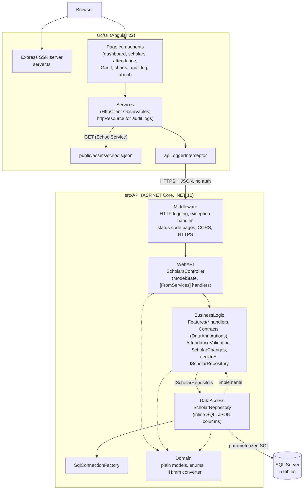
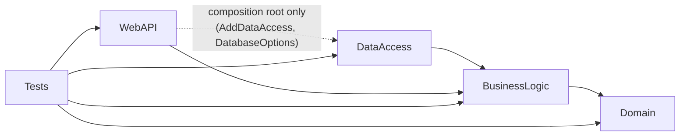
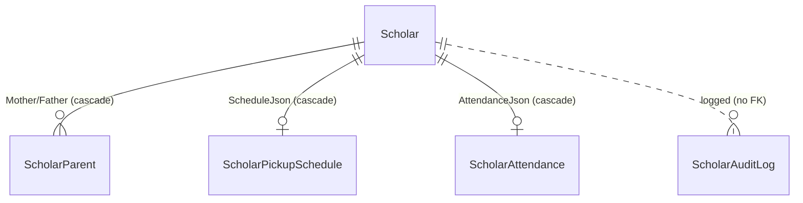

# Architecture & Design

> This document describes how the Imalo Education Webapp is built, as read from the source under `src/`, the build scripts and the tests. Statements that interpret the code rather than restate it are worded as such. The `ai_docs/` folder holds shorter, task-oriented notes; where they and the source disagree, the source wins.

## Overview

Imalo Education Webapp is a full-stack CRUD application for an after-school program. It records **scholars** (students) with their **mother and father**, a Monday–Friday **pickup schedule**, and daily **attendance** (present, plus optional lunch and transport, each with a cost). It keeps an **audit log** of scholar creates, edits and deletes, and offers a dashboard, a pickup-time Gantt chart, monthly attendance grids, charts, CSV export and a test-data generator.

It is a three-tier **client–server** system:

| Tier | Location | Technology |
|---|---|---|
| UI | `src/UI/` | Angular 22: standalone components, signals, Signal Forms, zoneless, SSR through `@angular/ssr` + Express 5; custom CSS |
| API | `src/API/ImaloEducationApi/` | ASP.NET Core Web API on .NET 10, split into `Domain`, `BusinessLogic`, `DataAccess` and `WebAPI` projects, plus a test project |
| DB | `src/DB/ImaloEducation/` | SQL Server; SSDT project (`Microsoft.Build.Sql`) containing only tables, published as a dacpac with `sqlpackage` |

The API is a **layered monolith along Clean Architecture lines**. Project references point inward: `Domain` (models, no references) ← `BusinessLogic` (one handler per use case in feature folders, the request contracts with their validation rules, attendance rules, change descriptions, and the `IScholarRepository` interface it needs) ← `DataAccess` (`ScholarRepository`, which runs **parameterized inline SQL** over ADO.NET). `WebAPI` is the HTTP edge and the composition root. There is no ORM, no stored procedure and **no authentication**. Two parts of the model are stored as **JSON documents** in `NVARCHAR(MAX)` columns: the pickup schedule and the attendance list. School reference data (name, color, lunch and transport prices) is a static file in the UI, `public/assets/schools.json`; the database has no `School` table.

The repository is one of three sibling applications, with `customer-management-system` and `employee-management-system`. `SqlConnectionFactory.cs` and `GlobalExceptionHandler.cs` are identical to the siblings' apart from `namespace`/`using` lines, and the chart components `time-series-chart`, `donut-chart`, `kpi-tile` and `ranked-bar-chart` are byte-for-byte identical. Unlike the siblings, Imalo uses inline SQL rather than stored procedures and returns plain models rather than a response envelope (`ai_docs/index.md` calls both deliberate).

## High-Level Architecture



Responsibilities:

- **UI** — rendering, routing, form validation, joining scholars to schools by `schoolId`, attendance costs taken from school prices, client-side search/sort/CSV, and every dashboard and chart aggregation.
- **WebAPI** (`ScholarsController`, `Program.cs`) — routes, empty-id and route/body id checks, copying `AttendanceValidation` messages into `ModelState`, turning `null`/`false` results into 404 Problem Details; `Program.cs` wires the application together.
- **BusinessLogic** — the request contracts (`ScholarRequest`, `AttendanceRecordRequest`) with their DataAnnotations and mapping to Domain models; one handler per endpoint with empty-id guards; the audit trail (`ScholarAuditLogger`: written after the change, best-effort, with a "what changed" text from `ScholarChanges`); and the attendance cross-field rules (`AttendanceValidation`). It declares `IScholarRepository`.
- **DataAccess** (`ScholarRepository`) — SQL, transactions, JSON (de)serialization of the document columns, row mapping and choosing the connection string.
- **Domain** — plain models (no validation attributes), enums and the `HH:mm` JSON converter; no project or package references.
- **Database** — schema and integrity: primary/foreign keys, cascades, check constraints, `ISJSON` checks.

## Project Structure

```text
src/
├── API/
│   ├── ImaloEducationApi/
│   │   ├── ImaloEducation.WebAPI/          # Program.cs (composition root + pipeline), Controllers/ScholarsController,
│   │   │                                   # ErrorHandling/GlobalExceptionHandler, Routing/KebabCaseParameterTransformer
│   │   ├── ImaloEducation.BusinessLogic/   # Features/(Scholars, Attendance, AuditLog), Contracts/(ScholarRequest,
│   │   │                                   # AttendanceRecordRequest, PagedResponse), Abstractions/IScholarRepository,
│   │   │                                   # Validations/(AttendanceValidation, ScholarIdGuard), AddBusinessLogic()
│   │   ├── ImaloEducation.DataAccess/      # Repositories/ScholarRepository, DBConnection/SqlConnectionFactory,
│   │   │                                   # Configuration/DatabaseOptions, AddDataAccess()
│   │   ├── ImaloEducation.Domain/Models/   # Scholar, PickupSchedule (+ HourMinuteTimeOnlyConverter), AttendanceRecord,
│   │   │                                   # ScholarAttendance, AuditLogEntry, GlobalAuditLogEntry, Gender, AuditAction
│   │   ├── ImaloEducation.Tests/           # xUnit v3 + Moq + WebApplicationFactory + NetArchTest
│   │   └── Directory.Build.props, Directory.Packages.props, ImaloEducation.slnx, .editorconfig
│   └── Postman/                            # collection + environment for manual calls
├── DB/ImaloEducation/Tables/               # Scholar, ScholarParent, ScholarPickupSchedule, ScholarAttendance, ScholarAuditLog
└── UI/
    ├── public/assets/schools.json          # school reference data
    └── src/
        ├── server.ts, main.server.ts, main.ts
        └── app/
            ├── components/                 # pages, charts/*, gantt-chart, dialogs, toasts, nav, footer
            ├── services/                   # data services, UI-state services, guard, interceptor, title strategy
            ├── interfaces/, constants/, pipes/ (ron), utils/
            └── app.ts, app.config(.server).ts, app.routes(.server).ts
```

Root scripts: `build.sh` (builds and tests everything, starts nothing) and `run.sh` (starts/creates the Docker SQL container, publishes the dacpac, starts the API and the UI).

### API projects

Project references, from the `.csproj` files:



| Project | Responsibility | Key types | Depends on | Used by |
|---|---|---|---|---|
| `ImaloEducation.WebAPI` | HTTP edge, validation orchestration, composition root | `ScholarsController`, `GlobalExceptionHandler`, `KebabCaseParameterTransformer`, `Program` | BusinessLogic; DataAccess (only from `Program.cs`); `Microsoft.AspNetCore.OpenApi`, `Swashbuckle.AspNetCore.SwaggerUI` | Tests |
| `ImaloEducation.BusinessLogic` | Use cases, request contracts and their rules, audit policy, cross-field rules, persistence abstraction | 12 handlers under `Features/` (five scholar, four attendance, three audit-log), `IScholarAuditLogger`/`ScholarAuditLogger`, `ScholarChanges`, `ScholarRequest`, `AttendanceRecordRequest`, `PagedResponse<T>`, `IScholarRepository`, `AttendanceValidation`, `ScholarIdGuard` | Domain; `Microsoft.Extensions.DependencyInjection.Abstractions`, `Microsoft.Extensions.Logging.Abstractions` | WebAPI, DataAccess, Tests |
| `ImaloEducation.DataAccess` | Persistence, transactions, JSON columns, connection selection | `ScholarRepository`, `ISqlConnectionFactory`/`SqlConnectionFactory`, `DatabaseOptions` | BusinessLogic (Domain arrives transitively); `Microsoft.Data.SqlClient`, `Microsoft.Extensions.Options` and the two abstractions packages | WebAPI (`Program.cs`), Tests |
| `ImaloEducation.Domain` | Response and persistence shapes | `Scholar`, `PickupSchedule`, `HourMinuteTimeOnlyConverter`, `AttendanceRecord`, `ScholarAttendance`, `AuditLogEntry`, `GlobalAuditLogEntry`, `Gender`, `AuditAction` | nothing (BCL only) | BusinessLogic directly; the rest transitively |

WebAPI has no direct reference to Domain; `ScholarsController` reaches `Scholar` and the other models through BusinessLogic's reference. `Directory.Build.props` sets .NET 10, nullable warnings as errors, the recommended analyzer set, code style enforced on build, and warnings as errors when `CI`/`TF_BUILD` is set. Package versions are managed centrally in `Directory.Packages.props`.

## Application/Data Flow

### Flow 1 — Saving a scholar (create or update)

```text
ScholarFormComponent (one Signal Form for add and edit)
 ↓ toScholar(model, scholarId)  — always sends a pickupSchedule object; empty parent fields become null
 ↓ ScholarService.createScholar() → POST /api/scholars
 ↓ ScholarService.updateScholar() → PUT  /api/scholars/{scholarId}
 ↓ [ApiController]: JSON binding into ScholarRequest (HourMinuteTimeOnlyConverter, unmapped schedule members
 ↓                  rejected) + DataAnnotations on ScholarRequest → 400 ValidationProblem
 ↓ ScholarsController (update): empty id or route id ≠ body id → 400 ValidationProblem
 ↓ CreateScholarHandler / UpdateScholarHandler: null / empty-id guard; request.ToScholar()
 ↓ IScholarRepository → ScholarRepository, one SqlTransaction:
 ↓    update only: read "before" image with WITH (UPDLOCK)
 ↓    INSERT … OUTPUT INSERTED.ScholarId   |  UPDATE dbo.Scholar (0 rows → return null, rollback)
 ↓    schedule: INSERT, or IF EXISTS UPDATE ELSE INSERT  (skipped when PickupSchedule is null)
 ↓    Mother, Father: insert/upsert, or (update only) DELETE the role when all three fields are blank
 ↓    COMMIT → returns the created scholar | the "before" image | null
 ↓ IScholarAuditLogger.LogAsync(Created | Edited, ScholarChanges.Describe(before, after))
 ↓    separate connection, CancellationToken.None, failure logged (event 2) and swallowed
 ↑ 201 Created + Location | 200 OK with the scholar as mapped from the request | 404 Problem Details
 ↑ UI: toast; navigate to /scholars/{id}; on 400, toServerErrors() puts messages on the matching fields
```

### Flow 2 — Saving a month of attendance

```text
AttendancePerScholarComponent
  rxResource: getScholar(id) → switchMap → getAttendance(id)
  rxResource: SchoolService.getSchool(scholar.schoolId)   (prices from schools.json)
  days = linkedSignal(selected month, loaded records):
     loaded records + unsaved "stub" rows for the month's weekdays; edits survive month changes
  ticking lunch/transport on a present day copies the school's price into lunchCost/transportCost
  only rows that were loaded or touched (persisted = true) are sent
 ↓ AttendanceService.saveAttendance(scholarId, recordsToSave())  — the scholar's WHOLE list, all months
 ↓ POST /api/scholars/{scholarId}/attendance
 ↓ [ApiController]: binding into List<AttendanceRecordRequest>; [Range] 0–9999.99 on both costs
 ↓ ScholarsController: AttendanceValidation.Validate → duplicate dates; lunch/transport on an absent day → 400
 ↓ SaveAttendanceHandler (ScholarIdGuard; ToAttendanceRecord()) → ScholarRepository.SaveAttendanceAsync, one batch:
 ↓     SET XACT_ABORT ON; BEGIN TRAN
 ↓     UPDATE dbo.ScholarAttendance WITH (UPDLOCK, SERIALIZABLE) SET AttendanceJson = …
 ↓     IF @@ROWCOUNT = 0 INSERT … WHERE EXISTS (scholar)
 ↓     COMMIT
 ↑ 204 No Content | 404 when no scholar row exists
```

Attendance saves are not audit-logged.

### Flow 3 — Read-heavy pages

`DashboardComponent`, `ScholarListComponent`, `AttendanceComponent`, `GanttChartComponent` and `ChartsComponent` each load with `rxResource({ stream: () => forkJoin({...}) })`: all scholars, plus `schools.json` (all but the attendance grid) and every scholar's attendance (dashboard, attendance grid, charts). `GET /api/scholars` returns all scholars and `GET /api/scholars/attendance` returns every scholar's full attendance document, without paging. Filtering, sorting, searching, grouping, revenue and rate calculation, and CSV generation then run in the browser, in pure modules (`charts-data.ts`, `dashboard-data.ts`, `attendance-grid.ts`, `utils/chart-stats.ts`) and in `SortingService` and `CsvExportService`.

### Flow 4 — Audit log

Only `CreateScholarHandler`, `UpdateScholarHandler` and `DeleteScholarHandler` write audit entries, through `IScholarAuditLogger` → `IScholarRepository.AddAuditEntryAsync`. `GetScholarAuditLogHandler`, `GetAllScholarAuditLogHandler` and `DeleteAllScholarAuditLogHandler` serve the reads and the purge. The per-scholar log (`GET /api/scholars/{id}/audit-log`) is read by `AuditLogService`; the global log (`GET /api/scholars/audit-log/all`, paged, `LEFT JOIN`ed to `Scholar` for names, so deleted scholars show no name) by `GlobalAuditLogService`. Both services hold an `httpResource` driven by a bound signal. `DELETE /api/scholars/audit-log/all` empties the table.

### Flow 5 — Bulk operations in the browser

The API has no bulk endpoints. Scholar-list bulk delete sends one `DELETE` per selected scholar in sequence (`concatMap`), counts successes and failures, and reloads. The About page's test-data generator creates 20 random scholars one by one and saves random attendance for each.

## Layers and Responsibilities

| Layer | Responsibility | May depend on | Should not depend on | Representative code |
|---|---|---|---|---|
| UI components | Presentation, forms, client-side aggregation | UI services, pure helpers | `HttpClient` (none use it directly) | `scholar-list.component.ts`, `attendance-per-scholar.component.ts` |
| UI services | HTTP calls, static data, shared UI state | `HttpClient`, `NotificationService` | Components | `scholar.service.ts`, `school.service.ts`, `confirm-dialog.service.ts` |
| WebAPI | HTTP mapping, input checks, status codes, composition | Handlers (injected per action), contracts, `AttendanceValidation`, Domain types; DataAccess from `Program.cs` only | SQL, `IScholarRepository` | `ScholarsController`, `Program.cs` |
| BusinessLogic | Use cases, request contracts and field rules, audit policy, cross-field rules | Domain, its own `IScholarRepository`, DataAnnotations | DataAccess, ASP.NET Core, SqlClient | `UpdateScholarHandler`, `ScholarRequest`, `AttendanceValidation`, `ScholarChanges` |
| DataAccess | SQL, transactions, JSON columns, mapping | BusinessLogic abstractions, Domain types, `ISqlConnectionFactory` | HTTP types | `ScholarRepository` |
| Domain | Response and persistence shape | BCL (System.Text.Json for the schedule) | Any other project | `Scholar`, `AttendanceRecord` |
| Database | Schema and integrity | — | — | `Tables/*.sql` |

Observations:

- **Business rules are split two ways.** Field rules (DataAnnotations on the request contracts), cross-field attendance rules and the audit policy are in BusinessLogic; pricing is in the UI.
- **Pricing belongs to the UI.** Lunch and transport prices come from `schools.json` in the browser and are copied into each `AttendanceRecord`. The API accepts any cost from 0 to 9999.99 and knows nothing about schools.
- **Inner layers carry no HTTP types.** BusinessLogic and DataAccess return `null`/`false` for "not found", and the controller chooses 404. The handlers throw `ArgumentException` for an empty id (`ScholarIdGuard`) as a guard behind the controller's own check.
- **Some reads do not distinguish "unknown scholar".** `GET …/{id}/attendance` and `GET …/{id}/audit-log` return `200 []` for an id that does not exist.

## Design Patterns

### Layered architecture with compile-time boundaries

- **Where:** the four API projects and their `ProjectReference`s.
- **How:** `BusinessLogic → Domain`, `DataAccess → BusinessLogic`, `WebAPI → BusinessLogic` (+ `DataAccess` for composition). A BusinessLogic → DataAccess reference would create a cycle and fail to build. `LayerDependencyTests` (NetArchTest) has four rules: Domain references no other layer, ASP.NET Core or SqlClient; BusinessLogic references neither DataAccess, WebAPI, ASP.NET Core nor SqlClient; DataAccess references neither WebAPI nor ASP.NET Core; `WebAPI.Controllers` references neither DataAccess nor SqlClient.

### Handler per action, organized by feature

- **Where:** `BusinessLogic/Features/{Scholars, Attendance, AuditLog}`; `ScholarsController` takes each handler with `[FromServices]`.
- **How:** each action checks its input, calls one handler's `HandleAsync`, and maps the result to a status code. The create, update and delete handlers map the request to a `Scholar` and add the audit trail through `IScholarAuditLogger`; the other handlers forward to the repository after a guard. There is no mediator and no interface per handler.

### Repository with dependency inversion

- **Where:** `IScholarRepository` (BusinessLogic/Abstractions, 13 methods) and `ScholarRepository` (DataAccess).
- **How:** the interface is organized around the `Scholar` aggregate and what it owns (parents, schedule, attendance, audit entries). It returns a scholar as one flat object, hiding that parents are rows in `ScholarParent` and the schedule is a JSON column. `UpdateScholarAsync` returns the pre-update image, read under `UPDLOCK` in the same transaction, so the handler can describe the change. Unlike the sibling apps it was not split by area: every handler uses the one interface.

### Factory

`ISqlConnectionFactory`/`SqlConnectionFactory` opens a connection with a connection string chosen once, lazily: on Windows with `LocalSqlServer` configured it probes the Docker server (3-second timeout, no pooling) and falls back to the local server if the probe fails; otherwise it uses Docker. The `internal` constructor takes `isWindows` and a `canConnect` delegate so tests can drive both branches, including concurrent first calls probing only once.

### Document storage in JSON columns

- **Where:** `ScholarPickupSchedule.ScheduleJson` and `ScholarAttendance.AttendanceJson`.
- **How:** the repository serializes `PickupSchedule` and `List<AttendanceRecord>` with `System.Text.Json` and stores each as one value; the database only checks `ISJSON(...) = 1`. `PickupSchedule` rejects unknown members (`[JsonUnmappedMemberHandling(Disallow)]`) and reads/writes times through `HourMinuteTimeOnlyConverter` as strict `"HH:mm"`.
- **Why it fits:** both are always read and written as a whole per scholar, so a document avoids child tables and per-row upserts.
- **Cost:** the database cannot query or constrain individual entries, and every attendance save rewrites the scholar's whole history.

### Declarative validation

`ScholarRequest` (BusinessLogic/Contracts) uses `[Required]`, `[StringLength]`, `[Range]`, `[EnumDataType]`, `[DataType]` and `[CustomValidation]` (`ValidateBirthDate`: not in the future; `ValidatePhoneNumber`: a `[GeneratedRegex]` of 9–12 digits). `AttendanceRecordRequest` uses `[Range]` on both costs. Each maps to its plain Domain model (`ToScholar()`, `ToAttendanceRecord()`). `[ApiController]` runs these before the action and answers with an RFC 9457 validation problem. Cross-field and route rules are added to `ModelState` by hand.

### Options pattern with startup validation

`DatabaseOptions` binds the `ConnectionStrings` section with `ValidateDataAnnotations().ValidateOnStart()`; `Docker` is `[Required]`. `StartupValidationTests` checks that the app refuses to start with an invalid setting.

### Pipeline

ASP.NET Core middleware in `Program.cs`; on the UI, one functional interceptor, `apiLoggerInterceptor`.

### Strategy through framework extension points

`AppTitleStrategy : TitleStrategy`, `KebabCaseParameterTransformer : IOutboundParameterTransformer`, `GlobalExceptionHandler : IExceptionHandler`, `HourMinuteTimeOnlyConverter : JsonConverter<TimeOnly?>`.

### Table-driven comparator

`SortingService` maps a `SortType` (`'string' | 'number' | 'date'`) to a comparator in a `COMPARATORS` record and applies it to any row type, with nulls ordered first in ascending order.

### Cached shared observable

`SchoolService.schools$` is `http.get(...).pipe(shareReplay(1), catchError(() => of([])))`: `schools.json` is fetched once per app instance, and a failure becomes an empty list.

### Reactive state with signals

`rxResource` + `forkJoin` for page loads; `httpResource` bound to a signal-of-a-function for audit logs; `linkedSignal` for form models that reset when loaded data changes (the scholar form's model, the attendance `days`, the selection set in the list) and for keeping the last global-audit page while the next one loads.

### Promise-based dialog service

`ConfirmDialogService.confirm()` returns a `Promise<boolean>`; a newer request resolves a pending one as `false`. Components and `unsavedChangesGuard` use it.

### Patterns not present

No ORM, stored procedures, authentication, response envelope, unit of work, mediator library, caching layer or UI store library.

## Design Principles

### Single Responsibility Principle

- **Followed:** each handler holds one use case's policy (guards, audit); `ScholarAuditLogger` only writes audit entries; `AttendanceValidation` only checks attendance; `ScholarChanges` only describes changes; `SqlConnectionFactory` only picks and opens connections; `CsvExportService` only builds and downloads CSV; `SortingService` only sorts; `SchoolService` only serves school data. The chart and grid computations live in framework-free modules.
- **Not followed:** `ScholarRepository` (about 520 lines) owns SQL for all five tables, JSON serialization, transactions, mapping and audit paging. `Scholar` is still both the response and the (flattened) persistence shape; the request side and its validation now live in `ScholarRequest`.

### Open/Closed Principle

Adding a scholar field means editing `ScholarRequest` (and `ToScholar()`), `Scholar`, both SQL projections and the insert/update statements in `ScholarRepository`, `MapScholarFromReader`, `ScholarChanges`, the DDL and the UI form model. The design is not built for extension without modification; at this size that is a reasonable trade.

### Liskov Substitution / Interface Segregation

LSP is not exercised beyond framework base types. `IScholarRepository` (13 methods) is shared by all twelve handlers and the audit logger, each of which uses one or two of its methods; at this size the single interface was kept rather than split.

### Dependency Inversion Principle

Followed between projects. The handlers depend on `IScholarRepository`, which BusinessLogic declares and DataAccess implements; BusinessLogic references neither DataAccess nor SqlClient nor ASP.NET Core. The controller depends on concrete handlers, which nothing needs to substitute. `ISqlConnectionFactory` stays inside DataAccess because its signature exposes `SqlConnection`.

### DRY

- **Followed:** `AddParam`, `ToDbValue`, `GetUtcDateTime` and `MapScholarFromReader` centralize repeated ADO.NET code; `ReadScholarAsync` serves both `GetScholarAsync` and the update's "before" read; parents are handled by looping over `(role, first, last, phone)` tuples; one `scholar-form` component serves add and edit; `extractErrorMessage` and `toServerErrors` are shared by every page.
- **Not followed:**
  - The scholar `SELECT … LEFT JOIN` projection is written twice (`GetScholarsAsync`, `ReadScholarAsync`).
  - The phone regex exists in `ScholarRequest.cs` (`\z`-anchored) and in `environment.ts` (`$`-anchored).
  - `ScholarRequest`/`Scholar` and `AttendanceRecordRequest`/`AttendanceRecord` repeat the same properties, joined by hand-written mappers.
  - Infrastructure and UI files are copied verbatim across three repositories and must be kept in sync by hand. `apiLoggerInterceptor` still carries the siblings' redaction of `password`/`accessToken` and unwrapping of a `data` envelope, neither of which exists in this API.

### KISS / YAGNI

One controller, small handlers, one repository, inline SQL, plain model responses, static school data and whole-document JSON columns keep the system small. The lack of authentication is a scoping decision for a locally run app.

### Separation of Concerns

- HTTP stays out of BusinessLogic and DataAccess; they return `null`/`bool`, not status codes.
- Persistence is in `ScholarRepository`; audit side effects are in the write handlers and `ScholarAuditLogger`, change detection in `ScholarChanges`; pricing is in the UI.
- UI data services raise toasts (`tap(() => notificationService.show(...))`), mixing data access with user feedback; `…Silently` variants exist for bulk callers that summarize results themselves.

### Encapsulation

`Scholar`, `AttendanceRecord`, `PickupSchedule` and the request contracts are mutable classes with public setters; `CreateScholarAsync` writes the new id into the `Scholar` it receives (a fresh copy from `ToScholar()`, so the request itself is not changed). `AuditLogEntry`, `GlobalAuditLogEntry` and `ScholarAttendance` are immutable records. The `ScholarParent` table is hidden behind six flattened `Mother*`/`Father*` properties.

### Composition over inheritance

Followed; inheritance appears only from framework base types.

## Dependency Injection and Dependency Management

### API

- Built-in container with constructor injection. `Program.cs` calls `AddBusinessLogic()` and `AddDataAccess()`, each defined in its own project, and binds `DatabaseOptions`.

| Registration | Defined in | Lifetime |
|---|---|---|
| The 12 handlers | `BusinessLogic/BusinessLogicDependencyInjection` | Scoped (concrete) |
| `IScholarAuditLogger → ScholarAuditLogger` | `BusinessLogic/BusinessLogicDependencyInjection` | Scoped |
| `ISqlConnectionFactory → SqlConnectionFactory` | `DataAccess/DataAccessDependencyInjection` | Singleton |
| `IScholarRepository → ScholarRepository` | `DataAccess/DataAccessDependencyInjection` | Scoped |
| `DatabaseOptions` | `Program.cs` | Options, validated on start |
| `GlobalExceptionHandler`, ProblemDetails, health checks, HTTP logging, CORS, OpenAPI | `Program.cs` | framework |

- Handlers, `ScholarAuditLogger` and `GlobalExceptionHandler` use primary constructors; `ScholarRepository` uses an explicit constructor with `ArgumentNullException` guards. `ScholarsController` has no constructor: each action takes its handler with `[FromServices]`.
- Created directly, not injected: `SqlCommand`, `SqlTransaction` (via `BeginTransactionAsync`), a static `JsonSerializerOptions { PropertyNameCaseInsensitive = true }`. `ScholarChanges`, `AttendanceValidation` and `ScholarIdGuard` are static classes.

### UI

- All services are `providedIn: 'root'` and injected with `inject()`; the guard and the interceptor are functions.
- `app.config.ts` provides the router (component input binding, scroll restoration, view transitions), `AppTitleStrategy`, hydration with event replay, and `HttpClient` with `withFetch()` and the interceptor.
- `app.config.server.ts` adds `provideServerRendering(withRoutes(serverRoutes))` and overrides Angular's internal `ɵHTTP_FETCH_MAX_RESPONSE_SIZE` to 10 MB.
- Services read `environment.apiUrl` directly.

## UI Architecture

### Framework and bootstrap

Angular 22, standalone components, zoneless, SSR with hydration and event replay. `app.routes.server.ts` **prerenders** `create-scholar` and `about`; every other route is **rendered on the server per request**. Because the API needs no credentials, server rendering fetches real data — which is why the server fetch limit was raised (per `ai_docs`, `GET /attendance` outgrew the 1 MB default). `server.ts` is a plain Express app serving the browser bundle statically and handing every other request to `AngularNodeAppEngine`.

### Shell

`App` renders a skip link, the navigation bar, the router outlet, the footer, toasts and the confirm dialog. In the browser it polls `GET /health` every 15 seconds and replaces the page with an "API is not running" card when it fails; after each navigation it moves focus to the page's `h1`. There is no login, so nothing toggles the shell.

### Routing

| Route | Component |
|---|---|
| `/` → `/dashboard` | `dashboard` (KPIs, today's pickups, upcoming birthdays, recent activity) |
| `/scholars` | `scholar-list` (search, sort, select, bulk delete, CSV) |
| `/scholars/:scholarId` | `scholar-details` (parents, schedule, audit trail, delete) |
| `/create-scholar`, `/scholars/update/:scholarId` | `scholar-form` (one component; `unsavedChangesGuard`) |
| `/pickup-time` | `gantt-chart` (weekdays × scholars on a time grid, colored by school) |
| `/attendance` | `attendance` (monthly grid for every scholar) |
| `/attendance/:scholarId` | `attendance-per-scholar` (editable month, CSV, print invoice; `unsavedChangesGuard`) |
| `/charts` | `charts` (revenue, attendance, pickup heatmap, demographics) |
| `/audit-log` | `global-audit-log` (paged, clear all) |
| `/about` | `about` (API-logging toggle, test-data generator) |
| `**` | `page-not-found` |

Every route is lazy-loaded and titled; route parameters bind to signal `input()`s.

### State management

- No store. Each page owns its data through component-level `rxResource`s.
- Root `AuditLogService` and `GlobalAuditLogService` hold `httpResource`s that follow a signal bound by the page.
- `SchoolService` caches `schools.json`; `ApiLoggerService` keeps its toggle in `localStorage`; `NotificationService` and `ConfirmDialogService` hold UI state in signals.
- After writes, pages call `resource.reload()` or navigate.

### Communication with the API

- `HttpClient` with `withFetch()`, base URL `environment.apiUrl` (`https://localhost:7244`).
- Successes are the models themselves (`Scholar`, `Scholar[]`, `AttendanceRecord[]`, `PagedResponse<…>`); errors are Problem Details.
- `apiLoggerInterceptor` logs requests and responses to the browser console when enabled (default on in dev mode, toggled on the About page); it does nothing on the server.

### Forms and validation

- Signal Forms throughout: `scholar-form.ts` holds the model, schema and the `toFormModel`/`toScholar` mappers; `attendance-form.ts` holds the attendance schema (lunch/transport disabled unless present) and its mappers.
- The scholar schema mirrors the API's field rules, and adds UI-only requirements (gender, school and grade are required in the form but optional in the API).
- `toServerErrors()` maps a validation problem's `errors` keys to form fields by name, case-insensitively, falling back to the last path segment; leftovers become a form-level message.
- Unsaved changes are protected by `unsavedChangesGuard` and a `beforeunload` handler.

### Error and loading states

Each page derives `loading` and `loadError` from its resource; `extractErrorMessage` turns status 0 into a "could not reach the server / certificate" message and Problem Details into `errors`, `detail` or `title`. Action failures show inline `.app-alert`s, successes show toasts (errors stay until dismissed). `attendance-per-scholar` shows an alert rather than an empty grid when loading fails, because a save would replace the whole list.

### UI-specific components

- `gantt-chart` lays pickup times on a time grid.
- `charts/` holds the shared `time-series-chart`, `donut-chart`, `kpi-tile` and `ranked-bar-chart` plus Imalo's own `heatmap` and `bar-chart`; the geometry and scale helpers are in `utils/`.
- `RonPipe` formats amounts in Romanian lei.
- Styling is custom CSS with design tokens in `styles.css`; there is no CSS framework.

## API Architecture

### Endpoint organization

One attribute-routed controller, `ScholarsController`, at `api/scholars` (route tokens kebab-cased by `KebabCaseParameterTransformer`):

| Method | Route | Result |
|---|---|---|
| `POST` | `/api/scholars` | 201 + `Location`, body = created scholar |
| `GET` | `/api/scholars` | 200, every scholar (no paging) |
| `GET` | `/api/scholars/{scholarId:guid}` | 200 / 404 |
| `PUT` | `/api/scholars/{scholarId:guid}` | 200 / 400 (id mismatch) / 404 |
| `DELETE` | `/api/scholars/{scholarId:guid}` | 204 / 404 |
| `GET` | `/api/scholars/{scholarId:guid}/audit-log` | 200 (empty list for an unknown id) |
| `GET` | `/api/scholars/audit-log/all?pageNumber&pageSize` | 200 `PagedResponse`; `pageNumber ≥ 1`, `pageSize` 1–100 (default 1/20) |
| `DELETE` | `/api/scholars/audit-log/all` | 204 |
| `POST` | `/api/scholars/{scholarId:guid}/attendance` | 204 / 400 / 404 — replaces the whole list |
| `GET` | `/api/scholars/{scholarId:guid}/attendance` | 200 (empty list when none) |
| `DELETE` | `/api/scholars/{scholarId:guid}/attendance` | 204 / 404 |
| `GET` | `/api/scholars/attendance` | 200, every scholar's attendance |

Plus `GET /health` (liveness only, excluded from HTTP logging) and, in Development, `/openapi/v1.json` with Swagger UI.

### Request flow

```text
UseHttpLogging → UseExceptionHandler → UseStatusCodePages → [Dev: MapOpenApi + SwaggerUI | else: UseHsts]
→ Cache-Control: no-store → UseCors → UseHttpsRedirection → MapHealthChecks / MapControllers
→ [ApiController] binding + DataAnnotations (→ 400 ValidationProblem)
→ ScholarsController (empty id, id mismatch, AttendanceValidation → ModelState)
→ [FromServices] handler (guards, mapping, audit) → IScholarRepository → SQL
← model | NoContent | Problem(404)
```

No authentication, authorization or rate-limiting middleware is registered.

### Request/response models

`ScholarRequest` is the create and update body and `Scholar` the response; both flatten the two parents into six properties and have the same JSON shape. The request's `ScholarId` is ignored on create and must match the route on update. `PickupSchedule` is strict (`Disallow` unknown members, `HH:mm` times); a `null` schedule on update leaves the stored schedule unchanged (the UI always sends one). `Gender` is serialized as a number; `AuditAction` as a string. Responses are not wrapped.

### Validation

1. JSON deserialization — the time converter throws `JsonException` for a bad time, which becomes a 400.
2. DataAnnotations on `ScholarRequest` and `AttendanceRecordRequest`, automatically via `[ApiController]`.
3. Controller checks — empty GUID, route/body id mismatch, and `AttendanceValidation` (duplicate dates; lunch/transport on an absent day), all through `ModelState` and `ValidationProblem()`.
4. Database constraints as the last line (`CK_Scholar_*`, `CK_ScholarParent_NotEmpty`, `ISJSON`).

### Error handling and serialization

See [Error Handling](#error-handling). Serialization is default System.Text.Json (camelCase) plus the time converter and the string-enum converter on `AuditAction`.

## Database Architecture

### Technology and deployment

SQL Server: an Azure SQL Edge container named `sqlserver` on port 1433, shared with the sibling apps, with an optional Windows local-server fallback. The SSDT project (`Microsoft.Build.Sql` 2.3.0, Azure SQL schema provider) contains only five tables — no procedures, views, seed data or pre/post-deployment scripts. `run.sh` publishes the dacpac with `sqlpackage /p:BlockOnPossibleDataLoss=false`. There are no migrations.

### Schema



| Table | Key | Notable constraints |
|---|---|---|
| `Scholar` | `ScholarId UNIQUEIDENTIFIER DEFAULT NEWSEQUENTIALID()` | `Gender IN (0,1,2)`, `Grade BETWEEN 0 AND 12`, `SchoolId > 0` (not a foreign key — schools live in the UI) |
| `ScholarParent` | `(ScholarId, Role)` | `Role IN ('Mother','Father')`; at least one of first name, last name, phone; FK `ON DELETE CASCADE` |
| `ScholarPickupSchedule` | `ScholarId` | `ISJSON(ScheduleJson) = 1`; FK `ON DELETE CASCADE` |
| `ScholarAttendance` | `ScholarId` | `ISJSON(AttendanceJson) = 1`; FK `ON DELETE CASCADE` |
| `ScholarAuditLog` | `ScholarAuditLogId INT IDENTITY` | `ActionType IN ('Created','Edited','Deleted')`; `OccurredAt DATETIME2(3) DEFAULT SYSUTCDATETIME()`; no FK, so history outlives the scholar; two indexes (per scholar, global), newest first |

### Data access

- **Inline parameterized SQL** in C# raw string literals; every parameter is typed and sized through `AddParam(command, name, SqlDbType, value, size)`.
- Rows are mapped by column name; `GetUtcDateTime` marks `OccurredAt` as UTC.
- The only string interpolation in SQL is `ReadScholarAsync`'s constant lock hint (`" WITH (UPDLOCK)"` or `""`), never user input.

### Transactions and concurrency

- Create and update use one ADO.NET `SqlTransaction` across the scholar row, schedule and parent rows. Update reads its "before" image under `UPDLOCK` inside that transaction, so the audit text reflects what was replaced. A missing scholar on update returns before commit, and disposal rolls back.
- `SaveAttendanceAsync` is one server-side batch: `SET XACT_ABORT ON`, `UPDLOCK, SERIALIZABLE`, update-else-insert guarded by `WHERE EXISTS (scholar)`, which prevents duplicate inserts under concurrency.
- Deletes rely on `ON DELETE CASCADE` for parents, schedule and attendance.
- Audit writes happen after commit on a separate connection, with `CancellationToken.None`, inside a `try/catch` that logs and swallows.
- Between users it is last-write-wins: no row version or ETag, and attendance is saved as a whole document.

### Connection management and caching

One pooled connection per repository call via `SqlConnectionFactory`. No server-side caching; the UI caches only `schools.json`.

## Error Handling

- **DataAccess:** returns `null`/`false` for "not found"; throws `ArgumentNullException` for null input and `InvalidOperationException` when an insert returns no id. `SqlException`s propagate.
- **BusinessLogic:** handlers throw `ArgumentException` for an empty id; `ScholarAuditLogger` catches and logs audit-write failures (`[LoggerMessage]` event 2).
- **Controller:** `ValidationProblem()` for input errors; `Problem(404)` with a `detail` for a missing scholar or attendance.
- **Global:** `GlobalExceptionHandler` answers 499 with no body (debug log, event 5) when the client aborted; otherwise logs an error (event 1) and writes a 500 Problem Details whose `detail` is the exception message only in Development. `UseStatusCodePages` gives bodiless error responses (such as an unknown route) a Problem Details body.
- **Logging:** JSON console logs with UTC timestamps (single-line simple format in Development); one combined HTTP log line per request (method, path, status, duration), except `/health`. Connection selection logs events 3 and 4.
- **UI:** per-page error states via `extractErrorMessage`; field errors via `toServerErrors`; the health card; optional console logging. There is no retry and no 401 handling (there is no auth).

## Configuration

| Source | Content |
|---|---|
| `appsettings.json` | `ConnectionStrings:Docker` and `:LocalSqlServer`, `Cors:AllowedOrigins` (`http(s)://localhost:4203`), JSON console logging, `AllowedHosts: *` |
| `appsettings.Development.json` | simple single-line console formatter |
| `launchSettings.json` | `https://localhost:7244`, opens Swagger |
| User secrets / environment variables | supported (`UserSecretsId` set); `run.sh` passes `ConnectionStrings__Docker` |
| `UI/src/environments/environment.ts` | `apiUrl`, `phoneNumberRegex` — one file, no per-environment variants |
| `UI/public/assets/schools.json` | school id, name, color, lunch and transport price |
| `run.sh` environment | `SQL_IMAGE`, `SQL_CONTAINER_NAME`, `SQL_SA_PASSWORD`, `SQL_PORT`, `SQL_PLATFORM`, `SQL_DATABASE`, `API_URL` |

`DatabaseOptions` is validated at startup. The committed Docker connection string contains the local development `sa` password. The only runtime toggle is the UI's API-logging switch.

## Security

- **No authentication or authorization.** Every endpoint is anonymous, including scholar deletion and `DELETE /api/scholars/audit-log/all`. `ai_docs` states this is deliberate because the app runs locally.
- **CORS** limits browsers to the UI's origin, to GET/POST/PUT/DELETE and to the `Content-Type` header. It does not stop non-browser clients that can reach the port.
- **The audit log has no actor**: it records what changed, not who changed it.
- **SQL injection:** parameterized SQL throughout; the one interpolation is a constant.
- **Input validation:** DataAnnotations, strict schedule JSON, cost ranges, cross-field rules and database check constraints.
- **Transport and headers:** HTTPS redirection, HSTS outside Development, `Cache-Control: no-store` on every response.
- **Data sensitivity:** children's names and birth dates and parents' phone numbers are served without access control — acceptable only under the local-only assumption, which nothing in the code enforces.
- **CSV export** (`CsvExportService`) quotes fields but does not neutralize formula-leading characters (`=`, `+`, `-`, `@`).
- **Secrets:** the dev `sa` password is committed in `appsettings.json` and `run.sh` defaults.

## Testing Architecture

### API

- xUnit v3 on Microsoft Testing Platform, Moq, `WebApplicationFactory<Program>`, `Microsoft.Extensions.Diagnostics.Testing` (fake logger), NetArchTest, code coverage.
- **Controller unit tests** — `Controllers/ScholarsControllerTests` pass real handlers built over a mocked `IScholarRepository` (and a no-op audit logger); cover every action and the attendance rules.
- **Handler unit tests** — `Features/Scholars/ScholarHandlersTests`, with a mocked `IScholarRepository`: audit entries on create/update/delete, no audit when nothing was found or deleted, a failed audit write logged and swallowed, empty ids never reaching the repository.
- **In-memory HTTP tests** — `Endpoints/ScholarEndpointTests` replace only `IScholarRepository` and send the bodies the UI sends, checking URLs, verbs, wire format, validation and status codes through the real controller and handlers.
- **Error and pipeline tests** — `ErrorHandling/ErrorResponseTests` (400/404/500 shapes, malformed JSON, unknown routes, one access-log line per request except health, 499 on abort) and `GlobalExceptionHandlerTests`.
- **Contract and model tests** — `Contracts/ScholarRequestValidationTests`, `Contracts/ScholarRequestRuleTests`, `Models/WireFormatTests` (strict `HH:mm`, unknown day rejected, gender as a number, `OccurredAt` as UTC).
- **Helpers and infrastructure** — `Features/Scholars/ScholarChangesTests`, `DataAccess/SqlConnectionFactoryTests`, `Configuration/StartupValidationTests`.
- **Architecture** — `Architecture/LayerDependencyTests`: the four rules listed under Design Patterns.
- **Not tested:** the SQL in `ScholarRepository` (transactions, upserts, cascades, JSON round-trips) has no automated test against a database.

### UI

Vitest through `@angular/build:unit-test` with jsdom; 40 co-located spec files covering services (`HttpTestingController`), pure helpers (`attendance-grid`, `dashboard-data`, `charts-data`, `chart-stats`, `server-errors`, …) and most page components (TestBed with plain-object fakes). No end-to-end tests.

### Architectural impact

The `IScholarRepository` seam lets the controller, the handlers' audit policy and the whole request pipeline be tested without a database. Only the SQL itself is left untested.

## Clean Architecture refactoring

The API used to be a single project in which controllers, SQL and models were separated only by folders. It is now four projects whose references enforce the direction of dependencies, matching the sibling apps. A second pass organized BusinessLogic by feature and moved the request contracts out of Domain. In both passes endpoints, JSON shapes, status codes, messages, SQL, log event ids and audit entries were kept the same, and the project names and single test project were kept.

### Dependencies before and after

```text
Before                                   After
ImaloEducationApi (one project):         Domain            (no references)
  Controllers → Data → Models            BusinessLogic  →  Domain (+ Microsoft.Extensions.* abstractions)
  (folders only; nothing enforced)       DataAccess     →  BusinessLogic
                                         WebAPI         →  BusinessLogic, DataAccess (composition root only)
```

### Pass 1 — violations fixed

| Violation | Fix |
|---|---|
| Controllers, SQL and models shared one project, separated only by folders | Four projects (`ImaloEducation.Domain`, `.BusinessLogic`, `.DataAccess`, `.WebAPI`); project references enforce the direction |
| The controller depended on the SQL class's own interface, declared next to its implementation | The controller depends on `IScholarService`; the persistence interface `IScholarRepository` is declared in `BusinessLogic/Abstractions` and implemented in DataAccess |
| Audit policy and change detection lived inside the SQL class | Moved to `ScholarService` and `ScholarFunctions/ScholarChanges`; the repository exposes a data-only `AddAuditEntryAsync`, and `UpdateScholarAsync` returns the pre-update image it reads under `UPDLOCK` |
| Attendance cross-field rules lived in the controller | Moved to `Validations/AttendanceValidation`; the controller copies its messages into `ModelState` |
| Empty-id guards lived in the SQL class | Moved to `ScholarService` |
| `Program.cs` registered SQL implementations directly | `AddBusinessLogic()` and `AddDataAccess()` live in their projects; `Program.cs` calls both |
| `DatabaseOptions` and `SqlConnectionFactory` sat in the web project | Moved to `DataAccess/Configuration` and `DataAccess/DBConnection` |

Tests followed: controller tests mocked `IScholarService`; endpoint and error-response tests replace only `IScholarRepository`; `ScholarServiceTests` and a first `LayerDependencyTests` rule were added. `build.sh`, `run.sh` and `.vscode` point at `ImaloEducation.slnx` and `ImaloEducation.WebAPI`.

### Pass 2 — feature organization

| Before | After |
|---|---|
| `IScholarService`/`ScholarService` (12 methods) with audit writing inline; `ScholarFunctions/ScholarChanges` | Service removed. `Features/Scholars` (five handlers + `ScholarChanges`), `Features/Attendance` (four), `Features/AuditLog` (three + `IScholarAuditLogger`/`ScholarAuditLogger`, same event id 2); controller actions take handlers with `[FromServices]`; empty-id checks share `ScholarIdGuard` |
| `Scholar` and `AttendanceRecord` in Domain carried DataAnnotations and served as request bodies; `PagedResponse<T>` in Domain | `ScholarRequest` and `AttendanceRecordRequest` in `BusinessLogic/Contracts` carry the rules and map to plain Domain models; `PagedResponse<T>` moved to Contracts |
| One architecture rule (Domain ↛ DataAccess) | Four rules covering Domain, BusinessLogic, DataAccess and the controller |
| `Services/ScholarServiceTests`, `Models/Scholar*ValidationTests`, controller tests over a mocked service | `Features/Scholars/ScholarHandlersTests`, `Contracts/ScholarRequest*Tests`, controller tests over real handlers with a mocked repository |

`IScholarRepository` was deliberately not split: it serves one aggregate and 13 methods.

### Remaining compromises

- **WebAPI references DataAccess.** Something must compose the app; a separate composition-root project would add a project without adding protection. Only `Program.cs` uses the reference.
- **Domain still shapes the wire format.** `Scholar` is returned directly, and `PickupSchedule` (with its strict JSON settings and `HH:mm` converter) is used inside `ScholarRequest`, so Domain types remain part of the HTTP contract.
- **Most handlers are pass-throughs.** Only create, update and delete add policy; the rest exist so the controller never sees the repository.

## Architectural Decisions

| Decision | What it solves | Trade-offs | Rationale evident? |
|---|---|---|---|
| Four API projects (Domain ← BusinessLogic ← DataAccess; WebAPI composes) | Compile-time layer boundaries, dependency inversion, business logic testable without SQL, same shape as the siblings | More projects and a handler hop for a small domain; many pass-through handlers | Yes — see [Clean Architecture refactoring](#clean-architecture-refactoring) |
| Inline parameterized SQL, no stored procedures or ORM | SQL sits next to its mapping; nothing extra to deploy | SQL untested; schema knowledge spread over C# strings | Stated as deliberate in `ai_docs` |
| JSON columns for schedule and attendance | Whole-document reads and writes; no child tables | No SQL-level query or constraint per entry; full rewrite on each save; all attendance shipped to the browser | Not stated beyond describing it |
| Static school data in the UI | No `School` table or endpoints | Prices can differ between deployments; `SchoolId` unchecked by the DB; prices snapshotted by the client | Stated as deliberate in `ai_docs` |
| No authentication | Simplicity for local use | Open destructive endpoints; no actor in the audit log | Stated: "runs locally only" |
| Plain models + Problem Details, no envelope | Idiomatic REST | Differs from the siblings' contract | Stated as deliberate |
| Most routes server-rendered per request | Real data in the first HTML | API calls on the server for each navigation; fetch limit raised to 10 MB | Partly (the size limit is explained) |
| Audit written after commit, best-effort, no FK | An audit failure never fails a user's change; history survives deletion | Entries can be lost | Implied by code comment and `try/catch` |
| Code copied across sibling repos | Same conventions everywhere | Manual synchronization; leftovers such as the interceptor's redaction | Stated in `ai_docs` |

## Strengths

- **Small, with enforced boundaries.** One controller, twelve small handlers and one repository cover the API; project references and four architecture tests stop inner layers from reaching outward.
- **HTTP stays out of the inner layers.** Handlers and the repository return `null`, `bool` or models; the controller decides status codes.
- **Idiomatic REST surface.** Resource-oriented routes, correct verbs, `201` with `Location`, `204`, and Problem Details for every error, including unknown routes and aborted requests.
- **Layered validation.** Strict JSON converters, DataAnnotations on dedicated request contracts, explicit cross-field rules and database check constraints back each other up, and the UI mirrors the field rules.
- **Careful writes.** Transactions over multi-table writes, `UPDLOCK` for the audit "before" image, and an `UPDLOCK, SERIALIZABLE` attendance upsert.
- **Cohesive aggregate API.** `IScholarRepository` presents parents and JSON columns as one `Scholar`.
- **Good test seams.** In-memory endpoint tests with only the repository faked, handler tests for the audit policy, and framework-free UI helpers with their own specs.

## Technical Debt / Design Concerns

1. **No access control on a destructive, personal-data API.** Every endpoint, including deleting scholars and clearing the audit log, is anonymous, and the data covers children and their parents' phone numbers. The safety rests on a "local only" assumption that nothing enforces; CORS does not restrict non-browser clients.

2. **`ScholarRepository` is large.** About 520 lines of SQL for five tables, JSON handling, transactions, mapping and paging in one class, with the scholar projection duplicated.

3. **Business rules in two tiers.** Field rules, attendance rules and the audit policy are in BusinessLogic; pricing is in the UI.

4. **Prices are trusted from the client.** Costs come from the browser's `schools.json` and are accepted when within 0–9999.99, so revenue figures depend on whichever client wrote them.

5. **Unpaged whole-dataset reads and whole-document writes.** `GET /api/scholars` and `GET /api/scholars/attendance` return everything; the attendance payload already exceeded the 1 MB SSR fetch limit. Each attendance save rewrites the scholar's whole history with last-write-wins and no concurrency token. Growth in scholars or history slows every page that aggregates attendance.

6. **One request shape for create and update.** `ScholarRequest` serves both; its id is ignored on create and must match the route on update, and a `null` schedule means "unchanged" rather than "clear". `Scholar` remains both the response and the flattened persistence model.

7. **JSON columns limit the database.** The database checks only `ISJSON`; shape, unique dates and cost rules exist only in C#, and reporting has to happen in application code (today, the browser).

8. **Untested SQL.** Transactions, upserts, cascades and JSON round-trips have no automated tests.

9. **No bulk endpoints.** Bulk delete and test-data generation issue one request per scholar from the browser, sequentially, with partial failure possible.

10. **UI services mix data and presentation.** Services toast in `tap`, `CsvExportService` drives the DOM, and the CSV export does not guard against spreadsheet formula injection.

11. **Copy-maintained shared code.** Infrastructure and UI files are duplicated across three repositories by hand, and copied code carries sibling-specific behavior.

## Summary

- **Architecture:** three-tier client–server — an Angular 22 SPA rendered mostly per request on an Express SSR server, an ASP.NET Core (.NET 10) API in four projects along Clean Architecture lines (Domain ← BusinessLogic ← DataAccess, WebAPI as composition root), and SQL Server reached through parameterized inline SQL with two JSON document columns. No authentication.
- **Major patterns:** layered architecture with compile-time boundaries checked by architecture tests, one handler per action organized by feature, request contracts mapped to plain models, repository with dependency inversion, connection factory, document storage in JSON columns, declarative validation with a strict JSON converter, options validation, middleware pipeline, signal-based UI state with `rxResource`/`httpResource`/`linkedSignal`, a cached shared observable for reference data, table-driven sorting, promise-based confirm dialog.
- **Major principles:** dependency inversion between projects, KISS, HTTP-free inner layers, framework-free UI computation modules, composition over inheritance.
- **Strengths:** small and direct, idiomatic REST with Problem Details everywhere, layered validation, careful transactional writes, cohesive aggregate API, strong test seams for the HTTP surface and the audit policy.
- **Most significant concerns:** anonymous destructive endpoints over personal data; a large single repository; business rules split between BusinessLogic and the UI with client-trusted prices; unpaged whole-dataset reads and whole-document attendance writes; one request shape for create and update; untested SQL; copy-maintained shared code.
