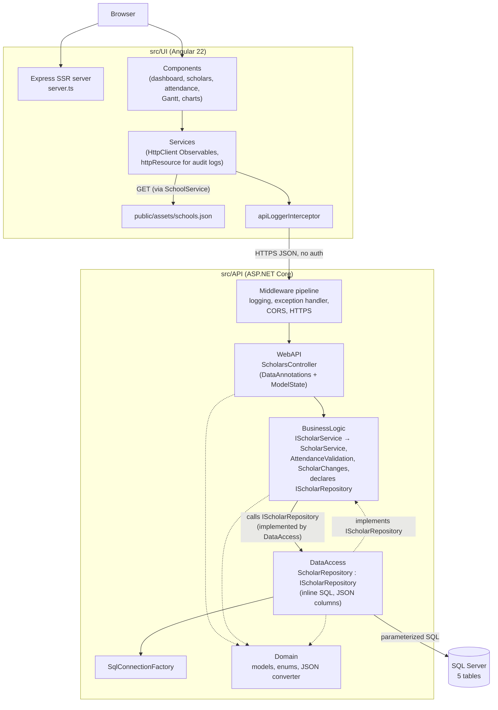
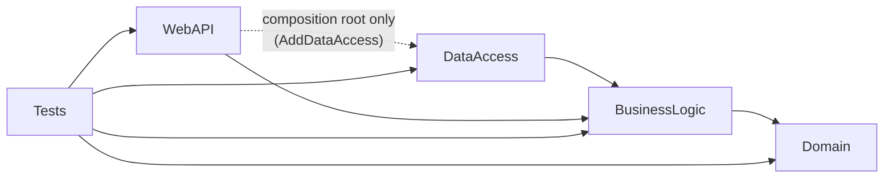
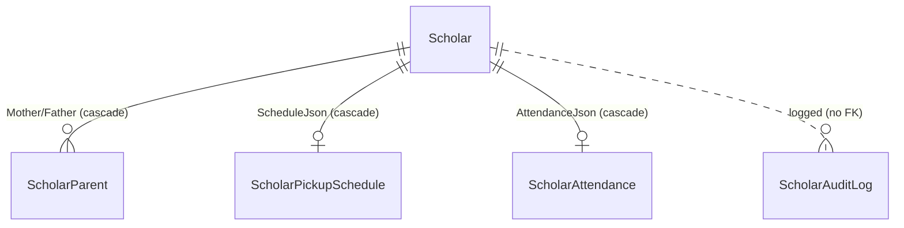

# Architecture & Design

> This document describes how the Imalo Education Webapp is actually built, derived from the source under `src/`. Where a statement is an interpretation rather than a fact visible in the code, it is worded as such. The `ai_docs/` folder holds shorter, task-oriented notes; where the two disagree, the source code is authoritative.

## Overview

Imalo Education Webapp is a full-stack CRUD application for an after-school program. It tracks **scholars** (students), their **parents**, a weekly **pickup schedule**, and daily **attendance** (presence plus optional lunch and transport, each with a cost), keeps a scholar **audit log**, and provides a dashboard, a pickup-time Gantt chart, attendance grids, and charts.

It is a three-tier **client–server** system:

| Tier | Location | Technology |
|---|---|---|
| UI | `src/UI/` | Angular 22 (standalone components, signals, Signal Forms, zoneless, SSR via `@angular/ssr` + Express), custom CSS |
| API | `src/API/ImaloEducationApi/` | ASP.NET Core (.NET 10) Web API: `Domain`, `BusinessLogic`, `DataAccess`, `WebAPI` projects + tests |
| DB | `src/DB/ImaloEducation/` | SQL Server, SSDT project (`Microsoft.Build.Sql`), tables only, deployed as a dacpac with `sqlpackage` |

The API is a **layered monolith organized along Clean Architecture lines**: four production projects whose compile-time references point inward — `Domain` (models, no dependencies) ← `BusinessLogic` (`ScholarService`, attendance rules, change detection, and the `IScholarRepository` abstraction it needs) ← `DataAccess` (`ScholarRepository`, which issues **parameterized inline SQL** over ADO.NET). `WebAPI` is the outer HTTP layer and composition root. See [Clean Architecture refactoring](#clean-architecture-refactoring) for what changed from the earlier single project. There is no ORM, no stored procedures, and **no authentication**. Parts of the data model are stored as **JSON documents** in `NVARCHAR(MAX)` columns (pickup schedule, attendance list). Reference data for schools lives in a static file in the UI (`public/assets/schools.json`), not in the database.

This repository is one of three sibling applications (with `customer-management-system` and `employee-management-system`). Per `ai_docs/index.md`, Imalo's API shape differs on purpose (inline SQL, no response envelope), while conventions and a set of files are shared. Comparing sources confirms that `SqlConnectionFactory` and `GlobalExceptionHandler` are identical to the siblings' apart from namespaces.

## High-Level Architecture



Responsibilities:

- **UI** — rendering, routing, form validation, joining scholars to schools by `schoolId`, client-side sorting/searching/CSV export, deriving attendance costs from school prices, all dashboard and chart aggregation.
- **WebAPI** (`ScholarsController`, `Program.cs`) — HTTP mapping, route/body consistency, turning `AttendanceValidation` errors into `ModelState` entries, translation of `null`/`false` results into 404 Problem Details; `Program.cs` composes the application.
- **BusinessLogic** (`ScholarService`) — empty-id guards, the audit trail (written after the change, best-effort, with the "what changed" description from `ScholarChanges`), and the attendance cross-field rules (`AttendanceValidation`); declares the persistence interface `IScholarRepository` it depends on.
- **DataAccess** (`ScholarRepository`) — implements `IScholarRepository`: SQL, transactions, JSON (de)serialization of document columns, mapping, connection selection.
- **Domain** — models, enums and the `HH:mm` JSON converter. It has no project or package references.
- **Database** — schema, constraints (`ISJSON` checks, cascades, check constraints).

## Project Structure

```text
src/
├── API/ImaloEducationApi/
│   ├── ImaloEducation.WebAPI/             # host: Program.cs (composition root + pipeline),
│   │                                      # Controllers/, ErrorHandling/, Routing/, appsettings
│   ├── ImaloEducation.BusinessLogic/      # Services/ (IScholarService, ScholarService), Abstractions/
│   │                                      # (IScholarRepository), ScholarFunctions/ScholarChanges,
│   │                                      # Validations/AttendanceValidation, AddBusinessLogic()
│   ├── ImaloEducation.DataAccess/         # Repositories/ScholarRepository, DBConnection/SqlConnectionFactory,
│   │                                      # Configuration/DatabaseOptions, AddDataAccess()
│   ├── ImaloEducation.Domain/Models/      # Scholar, PickupSchedule (+ JSON converter), AttendanceRecord,
│   │                                      # ScholarAttendance, AuditLogEntry, PagedResponse, enums
│   ├── ImaloEducation.Tests/              # xUnit v3 + Moq + NetArchTest
│   └── Directory.Build.props / Directory.Packages.props / ImaloEducation.slnx
├── DB/ImaloEducation/
│   └── Tables/                            # Scholar, ScholarParent, ScholarPickupSchedule,
│                                          # ScholarAttendance, ScholarAuditLog
└── UI/
    ├── public/assets/schools.json         # school reference data (name, color, prices)
    └── src/app/
        ├── components/                    # pages and widgets (charts/*, gantt-chart, attendance*, scholar-*)
        ├── services/                      # data services, sorting, CSV export, UI-state services
        ├── interfaces/, constants/, utils/, pipes/
        └── app.config*.ts, app.routes*.ts, app.ts
```

### API projects

Project references (from the `.csproj` files):



| Project | Responsibility | Key types | Depends on | Used by |
|---|---|---|---|---|
| `ImaloEducation.WebAPI` | HTTP edge, validation orchestration, composition root | `ScholarsController`, `GlobalExceptionHandler`, `KebabCaseParameterTransformer`, `Program.cs` | BusinessLogic; DataAccess (only `Program.cs`, for `AddDataAccess()` and `DatabaseOptions`); ASP.NET Core | ASP.NET routing, Tests |
| `ImaloEducation.BusinessLogic` | Use cases, audit trail, cross-field rules, persistence abstraction | `IScholarService`/`ScholarService`, `IScholarRepository`, `ScholarChanges`, `AttendanceValidation` | Domain, `Microsoft.Extensions.{DependencyInjection,Logging}.Abstractions` | WebAPI, DataAccess, Tests |
| `ImaloEducation.DataAccess` | Persistence, transactions, JSON columns, connection selection | `ScholarRepository`, `ISqlConnectionFactory`/`SqlConnectionFactory`, `DatabaseOptions` | BusinessLogic only (for `IScholarRepository`; Domain types arrive transitively), `Microsoft.Data.SqlClient`, `Microsoft.Extensions.Options` | WebAPI (`Program.cs`), Tests |
| `ImaloEducation.Domain` | API contract, validation rules, persistence shape | `Scholar` (DataAnnotations + custom validators), `PickupSchedule` + `HourMinuteTimeOnlyConverter`, `AttendanceRecord`, `ScholarAttendance`, `AuditLogEntry`, `GlobalAuditLogEntry`, `PagedResponse<T>`, `Gender`, `AuditAction` | nothing (BCL only: DataAnnotations, System.Text.Json) | BusinessLogic (direct); DataAccess and WebAPI (transitively); Tests |

WebAPI has no direct Domain reference: its controller uses Domain types (`Scholar`, `AttendanceRecord`, …) through BusinessLogic's transitive reference. `Architecture/LayerDependencyTests` checks with NetArchTest that Domain does not depend on DataAccess.

## Application/Data Flow

### Flow 1 — Saving a scholar (create/update)

```text
ScholarFormComponent (Signal Form; one component for add and edit)
 ↓ toScholar(model, scholarId) → ScholarService.createScholar() | updateScholar()
 ↓ POST /api/scholars   |   PUT /api/scholars/{scholarId}
 ↓ [ApiController] model validation on Scholar (DataAnnotations, CustomValidation, JSON converter)
 ↓ ScholarsController: route id ≠ body id → 400 ValidationProblem
 ↓ ScholarService.CreateScholarAsync | UpdateScholarAsync   (empty-id guard)
 ↓ ScholarRepository.CreateScholarAsync | UpdateScholarAsync
     one SqlTransaction:
       INSERT/UPDATE dbo.Scholar
       insert / upsert dbo.ScholarPickupSchedule.ScheduleJson   (only if PickupSchedule is not null)
       per parent role (Mother, Father): insert/upsert, or DELETE when all fields empty
     (update only) read "before" WITH (UPDLOCK) in the same transaction
     COMMIT; return the new scholar (create) | the "before" snapshot or null (update)
 ↓ ScholarService: IScholarRepository.AddAuditEntryAsync(Created | Edited,
     ScholarChanges.Describe(before, after))   (separate connection, best-effort, logged on failure)
 ↑ 201 Created + Location (create) | 200 OK with the scholar (update) | 404 Problem Details
 ↑ UI: toast; navigate to /scholars/{id}; on error toServerErrors() maps fields
```

### Flow 2 — Saving a month of attendance

```text
AttendancePerScholarComponent
  rxResource: getScholar(id) → switchMap → getAttendance(id)
  rxResource: SchoolService.getSchool(scholar.schoolId)   (prices from schools.json)
  days = linkedSignal(month, loaded records)  → Signal Form over the visible month
  ticking lunch/transport copies the school's current price into lunchCost/transportCost
 ↓ AttendanceService.saveAttendance(scholarId, recordsToSave())   (the scholar's WHOLE list)
 ↓ POST /api/scholars/{scholarId}/attendance
 ↓ [ApiController] validates each AttendanceRecord (cost ranges)
 ↓ ScholarsController: AttendanceValidation.Validate → duplicate dates → 400; lunch/transport on an absent day → 400
 ↓ ScholarService.SaveAttendanceAsync → ScholarRepository.SaveAttendanceAsync
     SET XACT_ABORT ON; BEGIN TRAN;
     UPDATE dbo.ScholarAttendance WITH (UPDLOCK, SERIALIZABLE) SET AttendanceJson = …
     IF @@ROWCOUNT = 0 INSERT … WHERE EXISTS (scholar)
     COMMIT
 ↑ 204 No Content | 404 if the scholar does not exist
```

Attendance saves are not audit-logged.

### Flow 3 — Read-heavy pages

`DashboardComponent`, `AttendanceComponent`, `ChartsComponent`, and `ScholarListComponent` each load their data with `rxResource({ stream: () => forkJoin({ scholars, schools, allAttendance, … }) })`. `GET /api/scholars` returns every scholar; `GET /api/scholars/attendance` returns every scholar's full attendance document. All filtering, sorting, searching, grouping, revenue calculation, and CSV generation then happen in the browser (`charts-data.ts`, `dashboard-data.ts`, `attendance-grid.ts`, `SortingService`, `CsvExportService`).

### Flow 4 — Audit log

Audit entries are written only by `ScholarService` (through `IScholarRepository.AddAuditEntryAsync`) after create, update, and delete. `GET /api/scholars/{id}/audit-log` and `GET /api/scholars/audit-log/all` (paged, joined to `Scholar` for names) are read through `AuditLogService` / `GlobalAuditLogService` (`httpResource`). `DELETE /api/scholars/audit-log/all` clears the log.

## Layers and Responsibilities

| Layer | Responsibility | May depend on | Should not depend on | Representative code |
|---|---|---|---|---|
| UI components | Presentation, forms, client-side aggregation | UI services, utils | `HttpClient` directly (none do) | `scholar-list.component.ts`, `attendance-per-scholar.component.ts` |
| UI services | HTTP calls, static data, generic helpers | `HttpClient`, `NotificationService` | Components | `scholar.service.ts`, `school.service.ts`, `sorting.service.ts` |
| WebAPI | HTTP mapping, validation, status codes, composition | `IScholarService`, `AttendanceValidation`, Domain types (transitively); DataAccess in `Program.cs` only | SQL, `IScholarRepository` | `ScholarsController`, `Program.cs` |
| BusinessLogic | Use cases, audit trail, cross-field rules | Domain, `IScholarRepository` (its own abstraction) | DataAccess, ASP.NET Core, SqlClient | `ScholarService`, `AttendanceValidation`, `ScholarChanges` |
| DataAccess | SQL, transactions, JSON columns | BusinessLogic abstractions (+ Domain types transitively), `ISqlConnectionFactory` | HTTP types, Domain directly | `ScholarRepository` |
| Domain | Wire contract + validation + persistence shape | DataAnnotations, System.Text.Json | Any other project | `Scholar`, `AttendanceRecord` |
| Database | Schema and integrity | — | — | `Tables/*.sql` |

Observations:

- **Business rules live in BusinessLogic, except field rules.** Attendance cross-field rules (unique dates, no lunch/transport when absent) are in `AttendanceValidation`; audit logging and change detection (`ScholarChanges`) are in `ScholarService`; field rules remain attributes on the Domain `Scholar`.
- **Pricing is a UI concern.** Lunch and transport prices come from `schools.json` in the browser and are copied into each `AttendanceRecord`. The API accepts whatever cost the client sends (bounded to 0–9999.99).
- **BusinessLogic and DataAccess stay free of HTTP types.** They return `null`/`false` for "not found", which the controller turns into 404s. `ScholarService` throws `ArgumentException` for an empty id, as a guard behind the controller's own checks.

## Design Patterns

### Layered architecture with compile-time boundaries

- **Where:** the four API projects and their `ProjectReference`s.
- **How:** `BusinessLogic → Domain`, `DataAccess → BusinessLogic`, `WebAPI → BusinessLogic` (+ `DataAccess` for composition in `Program.cs`). The compiler rejects a BusinessLogic → DataAccess dependency, and `LayerDependencyTests` checks Domain → DataAccess.

### Service layer

- **Where:** `ScholarsController` → `IScholarService` → `ScholarService`.
- **How:** each controller action validates, calls one service method, and maps the result to an HTTP response. Most service methods are pass-throughs with an empty-id guard; create, update and delete add the audit trail.

### Repository (Dependency Inversion)

- **Where:** `IScholarRepository` (BusinessLogic/Abstractions, 13 methods) / `ScholarRepository` (DataAccess).
- **How:** organized around the `Scholar` aggregate and its owned data (parents, schedule, attendance, audit log). It presents scholars as complete objects, hiding that parents live in a separate table and the schedule in a JSON column. `UpdateScholarAsync` returns the pre-update snapshot, read under `UPDLOCK` in the same transaction, so the service can describe the change.
- **Classification:** a repository for the `Scholar` aggregate, declared by the layer that uses it and implemented by the outer layer. It returns `PagedResponse` for the audit log.

### Factory

`ISqlConnectionFactory` / `SqlConnectionFactory` (identical to the siblings') chooses once between the Docker and the Windows-only local SQL Server connection string and returns an open connection. The `internal` constructor takes `isWindows` and a `canConnect` delegate for testing.

### Document storage (serialized JSON columns)

- **Where:** `ScholarPickupSchedule.ScheduleJson` and `ScholarAttendance.AttendanceJson`.
- **How:** the API serializes `PickupSchedule` and `List<AttendanceRecord>` with `System.Text.Json` and stores them as single values; the database only enforces `ISJSON(...) = 1`. `PickupSchedule` uses `[JsonUnmappedMemberHandling(Disallow)]` and a custom `HourMinuteTimeOnlyConverter` (`"HH:mm"`).
- **Problem solved:** schedule and attendance are always read and written as a whole per scholar, so a document avoids child tables and per-row upserts.
- **Trade-off:** the database cannot query or constrain individual records; every attendance edit rewrites the scholar's full history.

### Declarative validation (DataAnnotations + custom validators)

`Scholar` uses `[Required]`, `[StringLength]`, `[Range]`, `[EnumDataType]`, and `[CustomValidation]` (`ValidateBirthDate`, `ValidatePhoneNumber` with a `[GeneratedRegex]`). `AttendanceRecord` uses `[Range]` on costs. `[ApiController]` runs these automatically before the action, returning RFC 9457 validation problems. Cross-field rules are added imperatively to `ModelState`.

### Options pattern with startup validation

`DatabaseOptions` with `ValidateDataAnnotations().ValidateOnStart()`.

### Pipeline

ASP.NET Core middleware in `Program.cs`; on the UI, a single `apiLoggerInterceptor`.

### Strategy (framework extension points)

`AppTitleStrategy extends TitleStrategy`, `KebabCaseParameterTransformer`, `GlobalExceptionHandler : IExceptionHandler`, `HourMinuteTimeOnlyConverter : JsonConverter<TimeOnly?>`.

### Table-driven comparator (Strategy-like)

`SortingService` maps a `SortType` (`'string' | 'number' | 'date'`) to a comparator function in a `COMPARATORS` record and applies it generically to any row type. This is a small, data-driven strategy selection.

### Cached shared observable

`SchoolService` holds `schools$ = http.get(...).pipe(shareReplay(1), catchError(() => of([])))`, so `schools.json` is fetched once per application instance and failures degrade to an empty list.

### Observer / reactive state (UI)

`rxResource` with `forkJoin` for page loads; `httpResource` with `linkedSignal` for audit logs; `linkedSignal` for form models that reset when loaded data changes (e.g., the attendance `days` signal keeps unsaved edits across month changes but resets when new data loads).

### Promise-based dialog service

`ConfirmDialogService.confirm()` returns a `Promise<boolean>`; used by components and `unsavedChangesGuard`.

### Patterns not present

No ORM, stored procedures, authentication, response envelope, or UI store library.

## Design Principles

### Single Responsibility Principle

- **Followed:** `ScholarService` holds the use-case policy (guards, audit) and nothing else; `AttendanceValidation` only checks attendance rules; `ScholarChanges` only computes change descriptions; `SqlConnectionFactory` only selects/opens connections; `CsvExportService` only builds and downloads CSV; `SortingService` only sorts; `SchoolService` only provides school data; pure helper modules (`attendance-grid.ts`, `dashboard-data.ts`, `charts-data.ts`, `weekday-dates.ts`) contain no Angular dependencies.
- **Not followed:** `ScholarRepository` (≈520 lines) still handles SQL for scholars, parents, schedules, attendance, audit writes, audit reads, paging, JSON serialization, and mapping. `Scholar` is simultaneously the API contract, the validation model, and the persistence shape.

### Open/Closed Principle

Adding a field or entity requires editing the model, the controller, multiple SQL strings and mappers in `ScholarRepository`, `ScholarChanges`, and the DDL. The design is not structured for extension without modification.

### Liskov Substitution / Interface Segregation

LSP is not meaningfully exercised. `IScholarService` (12 methods) and `IScholarRepository` (13) each have one consumer, which is proportionate.

### Dependency Inversion Principle

Followed at the project level. `ScholarService` depends on `IScholarRepository`, which BusinessLogic declares and DataAccess implements; BusinessLogic has no reference to DataAccess, SqlClient or ASP.NET Core. The controller depends on `IScholarService`. `ISqlConnectionFactory` stays inside DataAccess because it exposes `SqlConnection`.

### DRY

- **Followed:** `AddParam`, `ToDbValue`, `GetUtcDateTime`, and `MapScholarFromReader` centralize repeated ADO.NET work; `ReadScholarAsync` is reused by `GetScholarAsync` and `UpdateScholarAsync`; parent handling iterates over a `(role, first, last, phone)` tuple array instead of duplicating Mother/Father code; `scholar-form` is one component for add and edit.
- **Not followed:**
  - The scholar `SELECT … JOIN` projection appears twice (`GetScholarsAsync` and `ReadScholarAsync`).
  - The phone-number regex is in `Scholar.cs` and in `environment.ts`.
  - Infrastructure and UI files are copied verbatim across the three sibling repositories (stated in `ai_docs`; confirmed by diff for `SqlConnectionFactory` and `GlobalExceptionHandler`).

### KISS / YAGNI

The API is intentionally small: one controller, one service, one repository, inline SQL, plain model returns, static school data, JSON columns for whole-document data. The absence of auth is a stated scoping decision ("runs locally only"). These choices keep the system small.

### Separation of Concerns

- The API keeps HTTP out of BusinessLogic and DataAccess (they return `null`/`bool`, not status codes) — cleaner than the siblings in this respect.
- Persistence is in `ScholarRepository`; the audit side effect and change detection are in `ScholarService`; pricing logic lives in the UI.
- UI data services trigger toasts (`tap(() => notificationService.show(...))`), coupling data access to presentation feedback; `…Silently` variants opt out.

### Encapsulation

`Scholar`, `AttendanceRecord`, and `PickupSchedule` are mutable classes with public setters; `CreateScholarAsync` mutates the caller's object (`scholar.ScholarId = insertedId`). Audit/read models (`AuditLogEntry`, `GlobalAuditLogEntry`) are immutable records. The `ScholarParent` table is fully hidden behind flattened `Mother*`/`Father*` properties.

### Composition over inheritance

Followed; the only inheritance is from framework base types.

## Dependency Injection and Dependency Management

### API

- Built-in container, constructor injection.
- Registrations: `Program.cs` (the composition root) calls `AddBusinessLogic()` and `AddDataAccess()`, each defined in its own project, and binds `DatabaseOptions`:

| Registration | Defined in | Lifetime |
|---|---|---|
| `IScholarService → ScholarService` | `BusinessLogic/BusinessLogicDependencyInjection` | Scoped |
| `ISqlConnectionFactory → SqlConnectionFactory` | `DataAccess/DataAccessDependencyInjection` | Singleton |
| `IScholarRepository → ScholarRepository` | `DataAccess/DataAccessDependencyInjection` | Scoped |
| `DatabaseOptions` (options) | `Program.cs` | validated on start |

- `ScholarService` and `ScholarRepository` use explicit constructors with `ArgumentNullException` guards (the siblings use primary constructors).
- Direct instantiation: `SqlCommand`, `SqlTransaction` (via `BeginTransactionAsync`), and a static `JsonSerializerOptions`. `ScholarChanges` and `AttendanceValidation` are static helpers.

### UI

- All services `providedIn: 'root'`; `inject()` field initializers; the only interceptor is functional.
- `app.config.server.ts` adds `provideServerRendering(withRoutes(serverRoutes))` and overrides the internal `HTTP_FETCH_MAX_RESPONSE_SIZE` token to 10 MB.
- `environment.apiUrl` is read directly by services.

## UI Architecture

### Framework and bootstrap

Angular 22, standalone components, zoneless, SSR with hydration and event replay. `app.routes.server.ts` **prerenders** only `create-scholar` and `about`; every other route is **server-rendered per request**. Because the API has no authentication, server-side rendering can fetch real data, which is why the server's fetch size limit was raised (per `ai_docs`, `GET /attendance` exceeded the 1 MB default).

### Shell

`App` renders navigation, router outlet, footer, toasts, and the confirm dialog; polls `/health` every 15 s in the browser and shows an API-down card; focuses the page heading after navigation. There is no login, so no navbar/footer toggling services.

### Routing

| Route | Component |
|---|---|
| `/` → `/dashboard` | `dashboard` (KPIs, today's pickups, birthdays, recent activity) |
| `/scholars` | `scholar-list` (client-side search/sort, bulk delete, CSV) |
| `/scholars/:scholarId` | `scholar-details` (parents, schedule, audit trail) |
| `/create-scholar`, `/scholars/update/:scholarId` | `scholar-form` (one component, `unsavedChangesGuard`) |
| `/pickup-time` | `gantt-chart` (weekdays × scholars × 15-minute slots, colored by school) |
| `/attendance` | `attendance` (monthly grid for all scholars) |
| `/attendance/:scholarId` | `attendance-per-scholar` (editable month, `unsavedChangesGuard`) |
| `/charts`, `/audit-log`, `/about` | charts, global audit log, about/test-data generator |
| `**` | `page-not-found` |

All routes are lazy and titled; route params bind to signal inputs.

### State management

- No store. Pages own their data through component-level `rxResource`s (often `forkJoin` of several Observables).
- Root `AuditLogService` and `GlobalAuditLogService` hold `httpResource`s bound to signals.
- `SchoolService` caches `schools.json` via `shareReplay(1)`.
- After writes, pages call `resource.reload()` (e.g., bulk delete in `scholar-list`).

### Communication with the API

- `HttpClient` with `withFetch()`, base URL `environment.apiUrl` (`https://localhost:7244`).
- Successful responses are the models themselves (`Scholar`, `Scholar[]`, `AttendanceRecord[]`) — no envelope. Errors are Problem Details.
- Endpoints are REST-style (`/api/scholars/{id}`, `/api/scholars/{id}/attendance`).

### Forms and validation

- Signal Forms throughout. `scholar-form.ts` (model, schema, `toFormModel`, `toScholar`) and `attendance-form.ts` (attendance schema and mappers).
- Attendance UI rules mirror the API's cross-field rules (lunch/transport disabled unless present).
- `toServerErrors()` maps validation problems onto fields.
- Unsaved-change protection via `unsavedChangesGuard` and `beforeunload`.

### Error and loading states

Per-resource `loading`/`loadError` computed from `rxResource`/`httpResource`; `extractErrorMessage` normalizes Problem Details; inline `.app-alert` for action failures; toasts for success. `attendance-per-scholar` shows an alert instead of an empty grid on load failure because saving replaces the whole list (stated in `ai_docs`).

### UI-specific components

- `gantt-chart` renders pickup times on a time grid.
- `charts/` includes shared components (`time-series-chart`, `donut-chart`, `kpi-tile`, `ranked-bar-chart`, identical to the siblings) plus Imalo-specific `heatmap` and `bar-chart`.
- Styling is custom CSS (no Bootstrap), with design tokens in `styles.css`.

## API Architecture

### Endpoint organization

One attribute-routed controller, `ScholarsController`, at `api/scholars`:

| Method | Route | Result |
|---|---|---|
| `POST` | `/api/scholars` | 201 + `Location`, body = created scholar |
| `GET` | `/api/scholars` | 200, all scholars (no paging) |
| `GET` | `/api/scholars/{scholarId:guid}` | 200 / 404 |
| `PUT` | `/api/scholars/{scholarId:guid}` | 200 / 400 (id mismatch) / 404 |
| `DELETE` | `/api/scholars/{scholarId:guid}` | 204 / 404 |
| `GET` | `/api/scholars/{scholarId}/audit-log` | 200 |
| `GET` | `/api/scholars/audit-log/all?pageNumber&pageSize` | 200, `PagedResponse` (validated with `[Range]`) |
| `DELETE` | `/api/scholars/audit-log/all` | 204 |
| `POST` | `/api/scholars/{scholarId}/attendance` | 204 / 400 / 404 (replaces the whole list) |
| `GET` | `/api/scholars/{scholarId}/attendance` | 200 |
| `DELETE` | `/api/scholars/{scholarId}/attendance` | 204 / 404 |
| `GET` | `/api/scholars/attendance` | 200, every scholar's attendance |

Plus `GET /health` (liveness only).

### Request flow

```text
UseHttpLogging → UseExceptionHandler → UseStatusCodePages → [Dev: OpenAPI + Swagger | else: HSTS]
→ Cache-Control: no-store → UseCors → UseHttpsRedirection → MapControllers
→ [ApiController] model binding + DataAnnotations validation (→ 400 ValidationProblem)
→ ScholarsController action (id checks, AttendanceValidation → ModelState)
→ IScholarService (guards, audit) → IScholarRepository → SQL
← model / NoContent / Problem(404)
```

No authentication, authorization, or rate-limiting middleware is registered.

### Request/response models

A single `Scholar` class is used for create input, update input, and output. It flattens mother/father into six properties. `PickupSchedule` enforces strict JSON (`Disallow` unmapped members, `HH:mm` times). `Gender` is numeric; `AuditAction` is a string. Responses are not wrapped.

### Validation

1. JSON deserialization (`HourMinuteTimeOnlyConverter` throws `JsonException` for bad times → 400).
2. DataAnnotations on models (automatic via `[ApiController]`).
3. Controller checks: empty GUID, route/body id mismatch, and the attendance rules from BusinessLogic's `AttendanceValidation` (duplicate dates, lunch/transport on absent days) — all reported through `ModelState` / `ValidationProblem()`.
4. Database constraints as the last line (`CK_Scholar_Grade`, `CK_ScholarParent_NotEmpty`, `ISJSON`).

### Error handling and serialization

See [Error Handling](#error-handling). Serialization is default System.Text.Json (camelCase) plus the custom time converter.

## Database Architecture

### Technology and deployment

SQL Server (Azure SQL Edge container `sqlserver`, shared with the sibling apps; optional Windows local-SQL fallback). The SSDT project contains only tables — no stored procedures, no seed data, no pre/post-deployment scripts. `run.sh` publishes the dacpac with `sqlpackage` and `BlockOnPossibleDataLoss=false`. There are no migrations.

### Schema



| Table | Key | Notable constraints |
|---|---|---|
| `Scholar` | `ScholarId UNIQUEIDENTIFIER` (`NEWSEQUENTIALID()`) | `CK` gender 0–2, grade 0–12, `SchoolId > 0` (not a FK; schools are in the UI) |
| `ScholarParent` | `(ScholarId, Role)` | `Role IN ('Mother','Father')`; at least one of first name, last name, phone; `ON DELETE CASCADE` |
| `ScholarPickupSchedule` | `ScholarId` | `ISJSON(ScheduleJson) = 1`; `ON DELETE CASCADE` |
| `ScholarAttendance` | `ScholarId` | `ISJSON(AttendanceJson) = 1`; `ON DELETE CASCADE` |
| `ScholarAuditLog` | `INT IDENTITY` | `ActionType IN ('Created','Edited','Deleted')`; no FK (history survives deletion); indexes per scholar and global, newest first |

### Data access

- **Inline parameterized SQL** in C# raw string literals; every parameter is typed via `AddParam(command, name, SqlDbType, value, size)`.
- Mapping is by column name; `GetUtcDateTime` stamps UTC on `OccurredAt`.
- JSON columns are (de)serialized with a shared `JsonSerializerOptions { PropertyNameCaseInsensitive = true }`.
- One string interpolation exists in SQL: `ReadScholarAsync` inserts a constant lock hint (`" WITH (UPDLOCK)"` or `""`), never user input.

### Transactions and concurrency

- `CreateScholarAsync` and `UpdateScholarAsync` use an ADO.NET `SqlTransaction` spanning the scholar row, schedule, and parent rows. `UpdateScholarAsync` reads the "before" image with `UPDLOCK` inside the same transaction so the audit description reflects what was replaced.
- `SaveAttendanceAsync` uses a server-side batch with `SET XACT_ABORT ON`, `UPDLOCK, SERIALIZABLE`, and an update-else-insert guarded by `WHERE EXISTS (scholar)`, preventing duplicate inserts under concurrency.
- Delete relies on `ON DELETE CASCADE` for children.
- Audit writes happen after commit on a separate connection with no cancellation token, inside a `try/catch` that logs and swallows failures.
- Concurrency control between users is last-write-wins: there is no row version or ETag, and attendance is saved as a whole document.

### Connection management and caching

One pooled connection per operation via `SqlConnectionFactory`; no server-side caching. The UI caches `schools.json` only.

## Error Handling

- **Data layer:** returns `null`/`false` for "not found"; throws `ArgumentException`/`ArgumentNullException` for programming errors and `InvalidOperationException` if an insert returns no id. SQL exceptions propagate. Audit-write failures are caught and logged (`[LoggerMessage]` event 2).
- **Controller:** builds `ValidationProblem()` for input errors and `Problem(404)` for missing scholars/attendance.
- **Global:** `GlobalExceptionHandler` (identical to the siblings') returns 499 if the client aborted the request, else logs (event 1) and returns a 500 Problem Details with `detail` only in Development. `UseStatusCodePages` gives bodiless errors a Problem Details body.
- **Logging:** JSON console logs (simple single-line in Development); HTTP logging of method/path/status/duration excluding `/health`.
- **UI:** per-resource errors through `extractErrorMessage`; `toServerErrors` for forms; health banner; console API logging (toggle on About page). There is no 401 handling because there is no auth, and no retry logic.

## Configuration

| Source | Content |
|---|---|
| `appsettings.json` | `ConnectionStrings:Docker`/`:LocalSqlServer`, `Cors:AllowedOrigins` (port 4203), logging |
| `appsettings.Development.json` | console formatter |
| `launchSettings.json` | `https://localhost:7244` |
| User secrets / env vars | supported (`UserSecretsId` set; `run.sh` sets `ConnectionStrings__Docker`) |
| `UI/src/environments/environment.ts` | `apiUrl`, `phoneNumberRegex` (single file, no per-environment variants) |
| `UI/public/assets/schools.json` | school names, colors, lunch and transport prices |
| `run.sh` env vars | `SQL_*`, `API_URL` |

`DatabaseOptions` is validated at startup. The committed Docker connection string contains a local development SA password. No feature flags beyond the UI's API-logging toggle.

## Security

- **No authentication or authorization.** Every endpoint is open, including `DELETE /api/scholars/audit-log/all` and scholar deletion. `ai_docs` states this is deliberate because the app runs locally.
- **CORS** limits *browsers* to the UI's origin and restricts methods/headers, but does not stop non-browser clients that can reach the port.
- **Audit log has no actor.** `ScholarAuditLog` records what changed, not who changed it (there is no identity to record).
- **SQL injection:** parameterized SQL throughout; the only interpolation is a constant lock hint.
- **Input validation:** DataAnnotations, strict JSON for schedules, cost ranges, cross-field rules, and DB check constraints.
- **Transport/headers:** HTTPS redirection, HSTS outside Development, `Cache-Control: no-store`.
- **Data sensitivity:** the API exposes children's names, birth dates, and parents' phone numbers without access control; this is acceptable only under the stated local-only assumption.
- **CSV export** in the UI (`CsvExportService`) quotes fields but does not neutralize formula-leading characters (`=`, `+`, `-`, `@`), unlike the siblings' server-side exporters.

## Testing Architecture

### API

- xUnit v3 (Microsoft Testing Platform), Moq, `WebApplicationFactory`.
- **Controller unit tests:** `Controllers/ScholarsControllerTests` with a mocked `IScholarService`.
- **Service unit tests:** `Services/ScholarServiceTests` with a mocked `IScholarRepository` — audit entries on create/update/delete, a failed audit write is logged (event 2) and swallowed, empty ids never reach the repository.
- **In-memory HTTP tests:** `Endpoints/ScholarEndpointTests` replace only `IScholarRepository` (the SQL layer) and exercise URLs, methods, JSON wire format, validation, and status codes through the real controller and service.
- **Model tests:** `Models/ScholarModelValidationTests`, `ScholarValidationTests`, `WireFormatTests` (e.g., `HH:mm` converter).
- **Helpers:** `ScholarFunctions/ScholarChangesTests`, `DataAccess/SqlConnectionFactoryTests`.
- **Architecture:** `Architecture/LayerDependencyTests` (NetArchTest) — `Domain_Should_Not_Reference_DataAccess`.
- **Infrastructure:** `ErrorHandling/*`, `Configuration/StartupValidationTests`.
- **Boundary:** `ScholarRepository` SQL (transactions, upserts, JSON round-trips, cascades) has no automated tests, as `ai_docs/api.md` notes.

### UI

Vitest via `@angular/build:unit-test`; co-located specs for services (`HttpTestingController`), pure helpers (`attendance-grid.ts`, `dashboard-data.ts`, `charts-data.ts`, `chart-stats.ts`), and most page components (TestBed with plain-object service fakes). No end-to-end tests.

### Architectural impact

The `IScholarService` seam makes the HTTP surface easy to test, and the `IScholarRepository` seam makes the audit policy testable without a database. Only the SQL itself remains untested.

## Clean Architecture refactoring

The API was split from one project into four so that inner layers no longer depend on outer ones, matching the sibling apps. Behavior is unchanged: same endpoints, status codes, messages, SQL, log event ids and audit entries.

### Dependencies before and after

```text
Before                                   After
ImaloEducationApi (one project):         Domain            (no references)
  Controllers → Data → Models            BusinessLogic  →  Domain (+ Microsoft.Extensions.* abstractions)
  (folders only; nothing enforced)       DataAccess     →  BusinessLogic
                                         WebAPI         →  BusinessLogic, DataAccess (composition root only)
```

### Violations fixed

| Violation | Fix |
|---|---|
| No layer boundaries: controllers, SQL and models shared one project, separated only by folders | Four projects (`ImaloEducation.Domain`, `.BusinessLogic`, `.DataAccess`, `.WebAPI`); project references enforce the direction |
| The controller depended directly on the SQL class's interface (`IScholarDataAccess`), declared next to its implementation | Controller depends on `IScholarService` (BusinessLogic); the persistence abstraction `IScholarRepository` is declared in `BusinessLogic/Abstractions` and implemented by `ScholarRepository` in DataAccess (Dependency Inversion) |
| Audit policy (write after commit, best-effort, log on failure) and change detection (`ScholarChanges`) lived inside the SQL class | Moved to `ScholarService` and `BusinessLogic/ScholarFunctions`; the repository exposes data-only `AddAuditEntryAsync`, and `UpdateScholarAsync` returns the pre-update snapshot it reads under `UPDLOCK` |
| Attendance cross-field rules lived in the controller | Moved to `BusinessLogic/Validations/AttendanceValidation`; the controller only copies the returned messages into `ModelState` |
| Empty-id guards lived in the SQL class | Moved to `ScholarService` |
| `Program.cs` registered the SQL implementations directly | `AddBusinessLogic()` and `AddDataAccess()` in their own projects; `Program.cs` calls both |
| `DatabaseOptions` and `SqlConnectionFactory` sat in the web project | Moved to `DataAccess/Configuration` and `DataAccess/DBConnection` |

Tests were retargeted: controller tests mock `IScholarService`, endpoint and error-response tests replace only `IScholarRepository`, and `ScholarServiceTests` (audit policy, guards) and `LayerDependencyTests` were added. `build.sh`, `run.sh` and `.vscode` point at `ImaloEducation.slnx` and `ImaloEducation.WebAPI`.

### Remaining compromises

- **WebAPI references DataAccess.** Something has to compose the application; a separate composition-root project would add a project without adding protection. The reference is used only by `Program.cs` (`AddDataAccess()` and `DatabaseOptions`); the controller imports no DataAccess namespace.
- **Domain holds transport-shaped types.** `Scholar` carries DataAnnotations and `PickupSchedule` a JSON converter, so the Domain models are also the wire contract. Splitting request/response DTOs from domain models would touch every layer and the UI contract.
- **Many service methods are pass-throughs.** Only create, update and delete add policy; the rest forward to the repository after a guard. They exist so the controller never sees the repository.
- The project is still named `DataAccess` (the "Db" layer in Clean Architecture terms), as in the sibling apps.

## Architectural Decisions

| Decision | What it solves | Trade-offs | Rationale evident? |
|---|---|---|---|
| Four API projects (Domain ← BusinessLogic ← DataAccess; WebAPI composes) | Compile-time layer boundaries, dependency inversion, use-case logic testable without SQL; same shape as the sibling apps | More projects and an extra service hop for a small domain; many service methods are pass-throughs | See [Clean Architecture refactoring](#clean-architecture-refactoring) |
| Inline parameterized SQL instead of stored procedures | SQL lives next to the mapping code; no proc deployment | SQL is untested; schema knowledge spread across C# strings | Stated as deliberate |
| JSON document columns for schedule and attendance | Whole-document reads/writes; no child tables | No SQL-level querying/constraints on items; full rewrite per save; all attendance must be shipped to the UI for aggregation | Not stated beyond describing it |
| Static school reference data in the UI | No `School` table or endpoints | Prices can differ between clients/deploys; `SchoolId` is unchecked by the DB; prices are snapshotted into attendance by the client | Stated as deliberate ("don't add a School table without asking") |
| No authentication | Simplicity for local use | Open destructive endpoints; audit log without actor | Stated: "runs locally only" |
| No response envelope; plain models + Problem Details | Idiomatic REST responses | Differs from sibling apps' `ResponseModel` contract | Stated as deliberate |
| Most routes server-rendered per request | Real data in initial HTML | Each navigation runs API calls on the server; fetch size limit raised to 10 MB | Partly — the size limit reason is in `ai_docs` |
| Audit written after commit, best-effort, no FK | Audit failures never fail user changes; history survives deletion | Possible missed entries | Implied by `try/catch` + log; mirrors siblings |
| Code copied across sibling repos | Consistent conventions | Manual synchronization | Stated in `ai_docs` |

## Strengths

- **Small, with enforced boundaries.** One controller, one service and one repository cover the API, and project references stop inner layers from depending on outer ones.
- **HTTP stays out of the inner layers.** `ScholarService` and `ScholarRepository` return domain results (`null`, `bool`, models), and the controller decides status codes — a cleaner boundary than the sibling apps' HTTP-coded results.
- **Idiomatic REST surface.** Resource-oriented routes, correct verbs, `201 Created` with `Location`, `204 No Content`, Problem Details for every error.
- **Declarative, layered validation.** DataAnnotations, a strict JSON converter, explicit cross-field rules, and DB check constraints back each other up.
- **Careful concurrency on writes.** Transactions for multi-table writes, `UPDLOCK` for the audit "before" image, and `UPDLOCK, SERIALIZABLE` for the attendance upsert.
- **Cohesive aggregate API.** `IScholarRepository` hides the parent table and JSON columns behind a single `Scholar` shape.
- **Testable seams.** In-memory endpoint tests with only the repository mocked; service tests for the audit policy; pure UI helpers separated from components and unit-tested.

## Technical Debt / Design Concerns

1. **No access control on a destructive, personal-data API.** All endpoints, including `DELETE /api/scholars/audit-log/all` and scholar deletion, are anonymous, and the data includes children's details and parents' phone numbers. The safety of this rests entirely on the "local only" deployment assumption, which nothing in the code enforces (CORS does not restrict non-browser clients).

2. **`ScholarRepository` is still large.** It owns SQL for five tables, JSON serialization, transactions, mapping, and audit paging (~520 lines). The audit policy and change detection have moved out to `ScholarService`, but the SQL is not split per table or concern.

3. **Business rules are only partly centralized.** Attendance rules and audit policy now live in BusinessLogic, but scholar field rules are still model attributes in Domain and pricing is in the UI.

4. **Pricing is trusted from the client.** Lunch and transport costs are computed in the browser from `schools.json` and accepted by the API as long as they fall within 0–9999.99. The API has no knowledge of schools or prices, so revenue figures depend on whichever client wrote them.

5. **Whole-dataset endpoints and full-document writes.** `GET /api/scholars` and `GET /api/scholars/attendance` return everything without paging; the attendance payload already exceeded the 1 MB SSR fetch limit. Each attendance save rewrites the scholar's entire history, with last-write-wins semantics and no concurrency token. Growth in scholars or history affects every page that loads attendance.

6. **One model for every purpose.** `Scholar` is the create request, the update request, the response, the validation model, and (flattened) the persistence model. Its `ScholarId` is ignored on create but required to match the route on update. `PickupSchedule = null` means "leave unchanged" on update rather than "clear", which is not evident from the contract.

7. **JSON columns limit the database's role.** The database only checks `ISJSON`; shape, date uniqueness, and cost rules are enforced solely in C#. Reporting queries over attendance must happen in application code (currently the browser).

8. **Untested SQL.** All persistence logic (transactions, upserts, cascades, JSON round-trips) has no automated tests.

9. **UI data services mixing data and presentation.** Services toast in `tap`, and `CsvExportService` manipulates the DOM. The CSV exporter does not guard against spreadsheet formula injection.

10. **Duplication across sibling repositories.** Infrastructure and UI files are maintained by copy across three repos.

## Summary

- **Architecture:** three-tier client–server — Angular 22 SPA with mostly per-request SSR, an ASP.NET Core Web API in four projects along Clean Architecture lines (Domain ← BusinessLogic ← DataAccess, WebAPI as composition root), and SQL Server accessed through parameterized inline SQL with JSON document columns. No authentication.
- **Major patterns:** layered architecture with compile-time boundaries, service layer, repository with dependency inversion (`IScholarRepository`), connection factory, document storage in JSON columns, declarative DataAnnotations validation with custom converters, options validation, middleware pipeline, signal-based reactive UI with `rxResource`/`forkJoin`, cached shared observable for static reference data, table-driven sorting.
- **Major principles:** dependency inversion across projects (BusinessLogic declares, DataAccess implements), KISS (one controller/service/repository), HTTP-free inner layers, pure UI helper modules, composition over inheritance.
- **Strengths:** small and direct, idiomatic REST with Problem Details, layered validation, careful transactional writes, cohesive aggregate API, good test seams for the HTTP surface.
- **Most significant concerns:** no access control on destructive endpoints with personal data; a large single repository class; pricing and field rules outside BusinessLogic; unpaged whole-dataset reads and full-document attendance writes; a single multi-purpose `Scholar` model; untested SQL.
